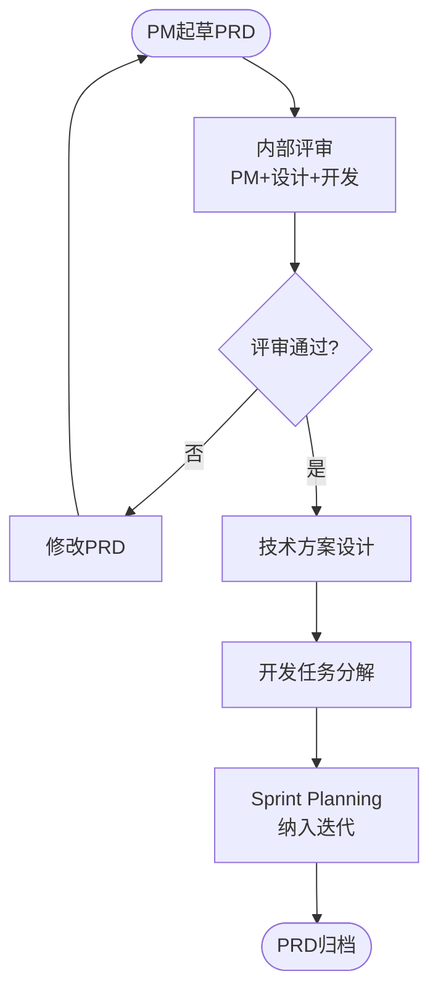
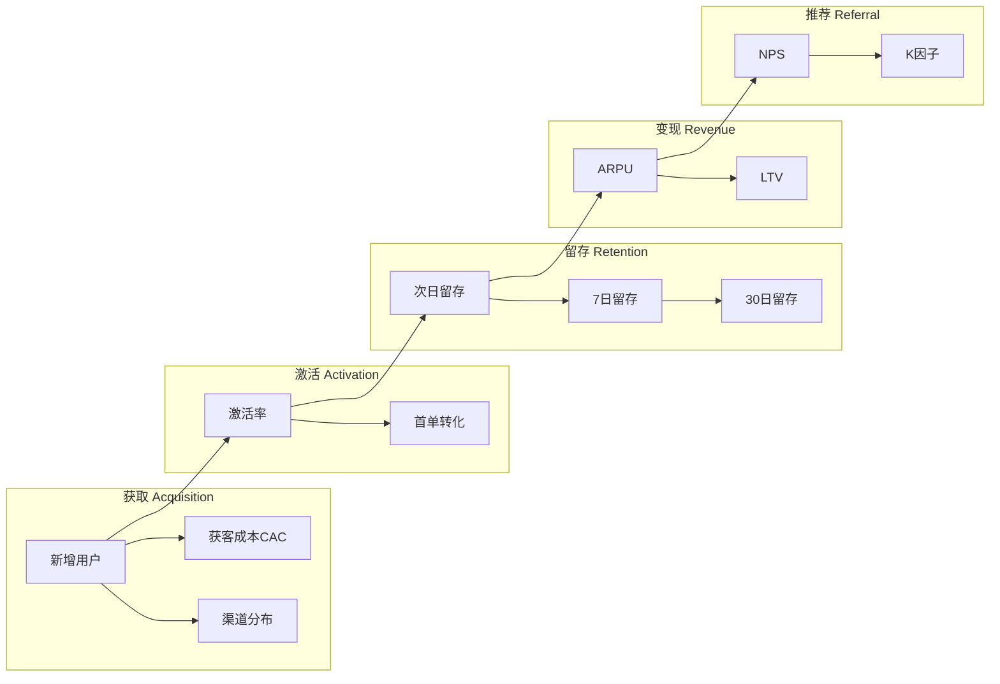
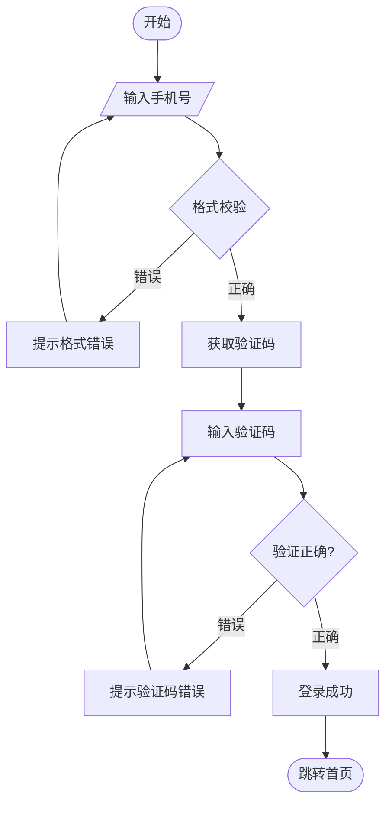
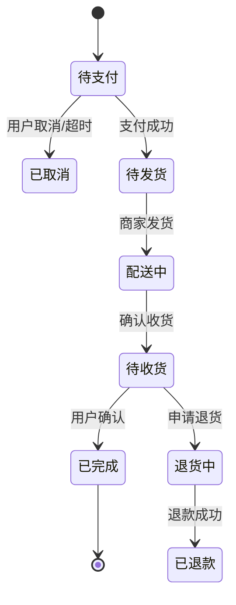
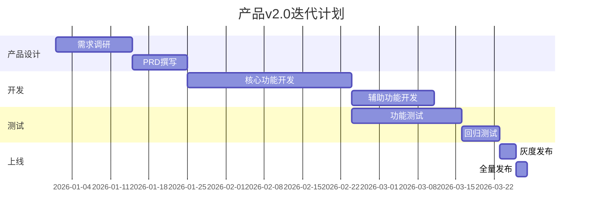
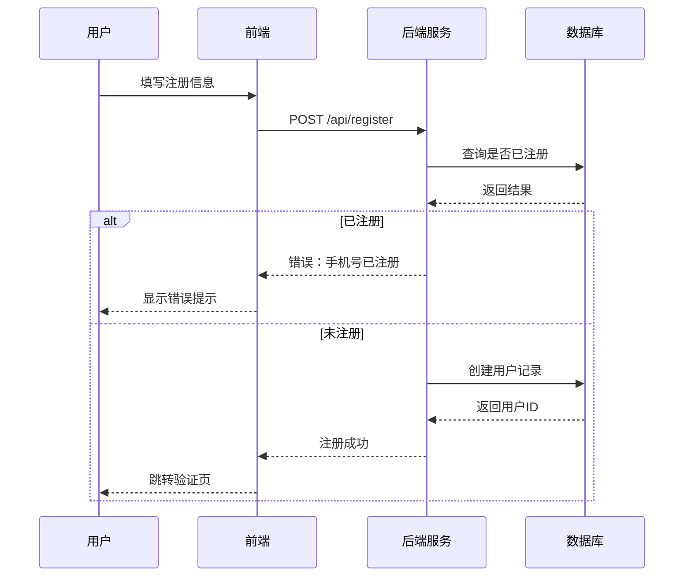
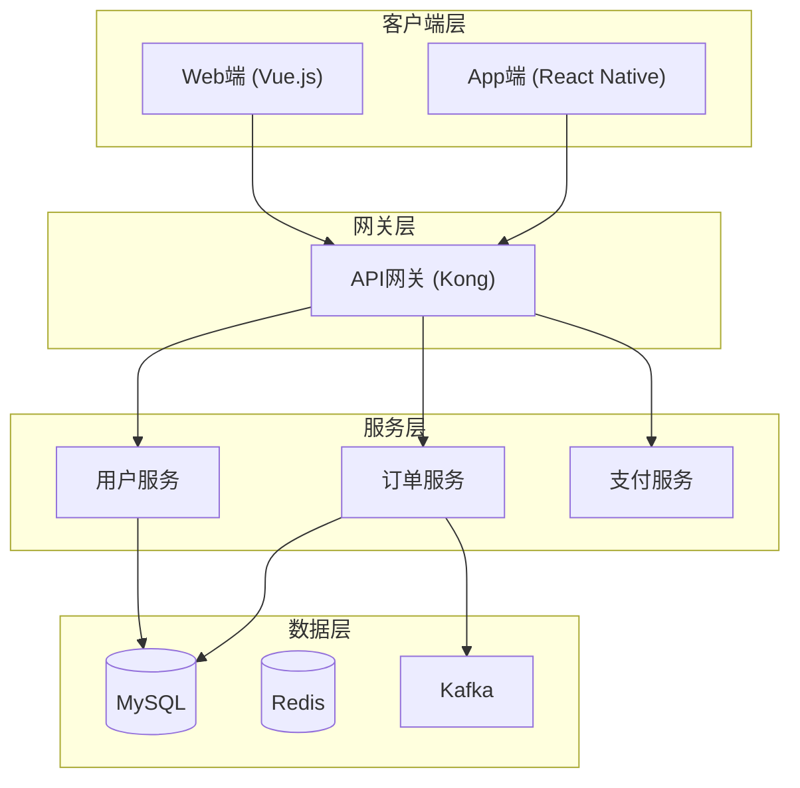
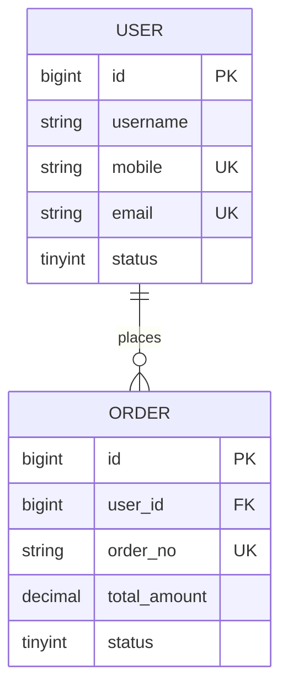
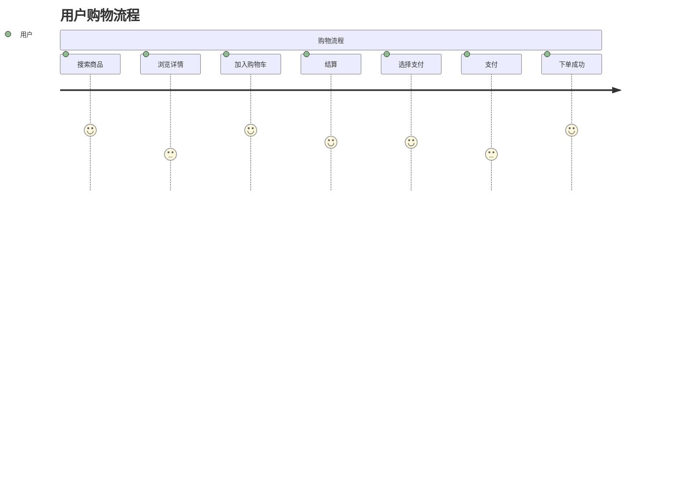

# 软件产品经理（Product Manager）知识技能

> 使用场景：用户需要产品经理级别的专业支持，或询问产品经理相关知识。
> 注意：本 skill 采用主动式产品咨询流程，不是单向知识问答。
> 流程：确认需求 → 提问澄清 → 网络搜索 + RAG搜索 → 产品规划 → PRD文档保存本地 + Mermaid图表整合。

---

# 主动式产品咨询流程

本 skill 不做单向知识问答，而是遵循以下流程：确认需求 → 提问澄清 → 网络搜索 + RAG资料搜索 → 产品规划 → PRD文档输出并保存本地 + Mermaid图表整合。

## 阶段一：确认需求（开口三问）

收到用户产品相关需求后，先用一段话确认理解，然后问三个核心问题：

**问题1：产品方向**
「你这个产品主要是做什么的？面向什么用户？解决什么核心问题？」

**问题2：平台形态**
「是移动端APP、小程序、Web端还是多端都要？C端还是B端？」

**问题3：成熟度**
「现在是从0到1的新产品，还是在现有产品上做迭代？有没有竞品可以参照？」

## 阶段二：多源资料搜索（关键修复）

根据用户回答，判断需要搜索哪些资料。**必须同时调用两种搜索方式**：

### 2.1 网络搜索（必做）

使用 `WebSearch` 工具搜索最新行业资料、竞品动态、设计趋势。使用自然语言描述搜索需求。

**搜索资源规划：**
- 需求分析类产品问题 → 搜索「需求分析方法 2026」「Kano模型 实践案例」「RICE评分 优先级」
- 产品设计类产品问题 → 搜索「APP产品设计趋势 2026」「PRD写作 最佳实践」「MVP设计方法论」
- 竞品分析类产品问题 → 搜索竞品名称 + 「功能对比」「产品策略」「用户评价」
- 数据分析类产品问题 → 搜索「AARRR指标 2026」「用户留存 提升方法」「DAU MAU 增长策略」
- 运动/健康类产品问题 → 搜索「健身APP市场分析 2026」「运动追踪APP 用户需求」「Keep 竞品分析」

示例搜索调用：
```
WebSearch: "运动健身APP用户需求分析 2026"
WebSearch: "跑步轨迹记录APP 功能设计"
WebSearch: "Keep 悦动圈 产品对比 2026"
```

### 2.2 RAG本地搜索（补充）

使用 `WebFetch` 工具获取官方文档，或用 `Grep`/`Read` 工具搜索本地参考文档。

**本地文档映射：**
- 需求分析类 → 调取 `pm-responsibilities.md`、`sdlc-product-process.md`
- 产品设计类 → 调取 `prd-template.md`、`mermaid-guide.md`
- 竞品分析类 → 调取 `pm-framework.md`（竞品分析框架）
- 数据分析类 → 调取 `pm-framework.md`（AARRR/留存分析）
- 路线图规划类 → 调取 `pm-framework.md`（OKR对齐）、`sdlc-product-process.md`

## 阶段三：产品规划

基于网络搜索结果和RAG资料，给出产品规划建议，包括：

**产品定位一句话**：「[产品名称]是一个面向[目标用户]的[产品类型]，解决[核心问题]。*

**核心功能优先级**（MoSCoW）：
- Must（必须有）：[核心路径功能，1-3个]
- Should（应该有）：[重要功能，2-4个]
- Could（可以有）：[增强功能，2-3个]
- Won't（这次不做）：[放未来规划的功能]

**MVP范围定义**：最小可行产品只做哪几个功能，为什么这几个是核心。

**用户旅程简化版**：
```
用户打开APP → [核心动作] → [得到什么价值] → [下一个动作/退出]
```

## 阶段四：PRD文档整合输出

整合网络搜索和RAG资料，输出完整PRD文档。**输出后必须使用 Write 工具保存到本地文件**。

### 文件保存规范

PRD文档保存路径：`C:\Users\yhong\projects\{产品名称}\PRD\{产品名称}_PRD_v0.1.md`

如果用户未指定产品名称，则保存到：`C:\Users\yhong\projects\{品类\}\PRD\{品类\}_PRD_v0.1.md`

例如：用户要做跑步APP，则保存到 `C:\Users\yhong\projects\running-app\PRD\running-app_PRD_v0.1.md`

### PRD文档模板

```markdown
# [产品名称] 产品需求文档 v0.1

## 1. 概述

### 1.1 背景
[为什么做这个产品，基于市场分析和用户需求]

### 1.2 产品定位
[一句话产品定位]

### 1.3 目标用户
[用户画像描述]

### 1.4 成功标准
| 指标 | 当前值 | 目标值 | 时间节点 |
|------|--------|--------|---------|
| [指标名] | [数值] | [数值] | [日期] |

### 1.5 竞品分析
[基于网络搜索的竞品对比]

### 1.6 参考资源
- [竞品官网/文章链接]
- [行业报告链接]

## 2. 用户与场景

### 2.1 用户画像
[用户画像描述：基本信息/使用场景/痛点/动机]

### 2.2 用户旅程
[文字描述关键步骤]

### 2.3 核心用例
| 用例编号 | 用例名称 | 触发条件 | 主路径 | 预期结果 |
|---------|---------|---------|--------|---------|
| UC-01 | [名称] | [条件] | [步骤] | [结果] |

## 3. 功能需求

### 3.1 功能列表
| 功能模块 | 功能名称 | 优先级 | 描述 |
|---------|---------|--------|------|
| [模块] | [功能] | P0 | [一句话描述] |

### 3.2 详细说明
[针对P0核心功能，详细描述功能逻辑]

### 3.3 验收标准
| 功能 | 验收条件 | 测试方法 |
|------|---------|---------|
| [功能] | [SMART标准] | [测试步骤] |

## 4. 非功能需求
| 类型 | 要求 |
|------|------|
| 性能 | [响应时间要求] |
| 安全 | [安全要求] |
| 兼容性 | [兼容要求] |
| 可靠性 | [可用性要求] |

## 5. 数据埋点
| 事件名称 | 触发时机 | 参数 |
|---------|---------|------|
| [事件] | [时机] | [参数] |

## 6. 风险与依赖
| 风险/依赖 | 影响 | 应对措施 |
|-----------|------|---------|
| [条目] | [描述] | [措施] |

## 7. 附录
- 修订记录
- 术语表
```

## 阶段五：Mermaid图表整合输出

根据产品类型，输出对应的Mermaid图表代码，放在PRD文档的相应位置：

**从0到1新产品** → 输出：
- 产品架构图（系统分层）
- 核心用户旅程图
- MVP功能优先级甘特图

**迭代类产品** → 输出：
- 需求状态流转图
- 迭代计划甘特图
- 跨团队协作时序图（PM/设计/开发/QA）

**竞品分析类** → 输出：
- 功能对比矩阵表
- 竞品架构对比图

**数据分析类** → 输出：
- AARRR漏斗图
- 用户留存曲线

---

# 知识速查

## 需求优先级三剑客

**Kano模型** — 将需求分为基本型（没有就强烈不满）、期望型（越多越满意）、兴奋型（超出预期）。资源有限时优先保基本型。

**RICE评分** — RICE = (影响人数 × 转化率提升 × 信心指数) ÷ 工作量(人天)。按分数排序。

**MoSCoW分类** — Must必须有（核心路径，无则产品不可用，占比约60%）、Should应该有（重要但可延期，占比约20%）、Could可以有（锦上添花，占比约15%）、Won't这次不做（放未来规划，占比约5%）。

## PRD核心结构

PRD的核心不是说清楚要做什么功能，而是说清楚「为什么做、做到什么程度、怎么才算成功」。标准7章：概述→用户与场景→功能需求→非功能需求→数据埋点→风险与依赖→附录。


### PRD评审流程




## AARRR海盗模型

Acquisition获取（新增用户数、获客成本CAC）、Activation激活（新用户激活率、首单转化率）、Retention留存（次日/7日/30日留存率）、Revenue变现（ARPU、LTV）、Referral推荐（NPS、裂变系数K因子）。


### 产品KPI体系




## Agile/Scrum速查

三个角色：Product Owner负责产品待办列表优先级排序、Scrum Master确保团队遵循Scrum流程清除障碍、Development Team跨职能团队负责交付。

五个仪式：Sprint Planning（每Sprint第一天2-4h规划内容）、Daily Standup（每天15min同步进展识别阻塞）、Sprint Review（每Sprint结束演示成果收集反馈）、Sprint Retrospective（每Sprint结束团队内部复盘）、Backlog Refinement（每周准备下个Sprint需求）。

---

# Mermaid图表速查

| 图表 | 关键词 | 用途 |
|------|--------|------|
| 流程图 | `flowchart TD/LR` | 用户核心路径和分支 |
| 时序图 | `sequenceDiagram` | 系统/角色调用顺序 |
| 状态图 | `stateDiagram-v2` | 实体状态流转 |
| 甘特图 | `gantt` | 项目计划和时间线 |
| 架构图 | `flowchart TB` | 系统分层和模块关系 |
| ER图 | `erDiagram` | 数据库表结构 |
| 用户旅程 | `journey` | 用户体验全流程情感 |

### 用户登录流程



### 订单状态流转



### 产品迭代甘特图



### 用户注册时序图



### 系统架构图



---

# 避坑指南

## 十大常见误区

| 误区 | 正确做法 |
|------|---------|
| ❌「我觉得用户需要这个」凭直觉做决策 | ✅ 用用户访谈、数据分析验证假设 |
| ❌ 功能越多越好，堆砌功能 | ✅ 少即是多，先做核心路径 |
| ❌ PRD写完就丢，不跟进落地 | ✅ 持续跟进，上线后跟踪数据 |
| ❌ 忽略技术边界，拍脑袋定排期 | ✅ 需求评审拉上技术，确认可行性 |
| ❌ 需求变更口头通知，不走流程 | ✅ 需求变更走正式流程，评估影响 |
| ❌ 只看转化率，忽略留存 | ✅ 结合留存、NPS、DAU综合评估 |
| ❌ 竞品有什么我就抄什么 | ✅ 理解定位，找差异化机会 |
| ❌ 排期过于乐观，不留Buffer | ✅ 评估工期乘以1.5-2倍风险系数 |
| ❌ 忽视非功能需求 | ✅ 性能/安全/兼容性需求阶段定义 |
| ❌ 上线无监控，不知道效果 | ✅ 上线前配置埋点和监控告警 |

## PRD写作常见错误

| 错误 | 正确做法 |
|------|---------|
| ❌ 背景写成了功能介绍（「我们要做分享功能」） | ✅ 背景说清市场/用户/机会 |
| ❌ 目标不可量化（「提升用户体验」） | ✅ 「注册转化率从60%提升到75%」 |
| ❌ 验收标准模糊（「界面美观大方」） | ✅ 「点击按钮后2秒内显示结果」 |
| ❌ 功能边界不清晰（「等等这个应该不算」） | ✅ 明确定义包含/不包含 |

---

# 快速参考

## 需求优先级

| 级别 | 含义 | 占比 |
|------|------|------|
| P0 / Must | 核心路径，无则不可用 | 60% |
| P1 / Should | 重要但可延期 | 20% |
| P2 / Could | 锦上添花 | 15% |
| P3 / Won't | 未来规划，本次不做 | 5% |

## 核心指标

| 维度 | 指标 |
|------|------|
| 活跃 | DAU/MAU/日均使用时长 |
| 留存 | 次日/7日/30日留存率 |
| 转化 | 注册转化率/付费转化率 |
| 变现 | ARPU/LTV/客单价 |
| 口碑 | NPS/评分/评论数 |

## PRD快速清单

- [ ] 背景说清楚了「为什么做」
- [ ] 目标可量化（数字，不是「提升体验」）
- [ ] 用户画像明确（不是「所有用户」）
- [ ] 功能有优先级（P0/P1/P2）
- [ ] 每个功能有验收标准（可测试）
- [ ] 非功能需求明确（性能/安全/兼容性）
- [ ] 风险有应对方案
- [ ] Mermaid图表涵盖架构图/用户旅程/迭代计划


---

# 输出格式规范

## 必须遵守

- 输出必须是一段干净连贯的文字，不能出现「根据参考文档」「第一层/第二层」「用XX框架分析」等分层标记或内部推理过程
- 不使用列表编号（如「1. 2. 3.」）做主要叙述方式，用自然段落
- 代码块用于展示具体内容，如Mermaid图表代码、PRD片段、用户故事模板
- Mermaid图表用 ```mermaid 代码块包裹
- 表格用于对比、矩阵等需要对照的场景

## 禁用格式

- ❌ 「根据搜索结果/参考文档/知识库」
- ❌ 「第一层/第二层/第三层」「认知操作系统」「蒸馏过程」
- ❌ 「用Kano框架分析」「用RICE评分方法」
- ❌ 刻意使用大量列表编号（超过5个连续列表项）

## 回复结构

知识讲解类先用一段话定义核心概念，再说具体方法/工具/场景，最后补充注意事项。需求分析类先确认用户的产品方向/平台/功能，再给出建议用自然段落，最后提供可操作的文档结构或图表代码。文档生成类先确认需求细节，直接输出文档内容含Mermaid图表代码，最后附上填写说明。


---

## 附件列表

参考文档共8个，覆盖PM职责、PRD模板、SDLC流程、Mermaid图表、分析框架、技能体系、职业路径、敏捷开发：

- `references/pm-responsibilities.md` — 产品经理职责与职业素养（554行）
- `references/prd-template.md` — PRD产品需求文档模板（489行）
- `references/sdlc-product-process.md` — 软件开发生命周期与产品流程（344行）
- `references/mermaid-guide.md` — Mermaid产品图表绘制规范（490行）
- `references/pm-framework.md` — PM分析框架（AARRR/RFM/SWOT/5W1H/Ansoff/波特五力/留存/竞品/商业模式画布，528行）
- `references/pm-skills.md` — PM技能体系（硬技能/软技能/工具技能/行业知识，476行）
- `references/pm-career-path.md` — PM职业发展路径（AP→CPO/转行/面试/薪资，498行）
- `references/agile-dev.md` — 敏捷开发实践（Scrum/Kanban/用户故事/DoD/技术债务，609行）

---

## 来源: 2026-04-23（更新频率：季度更新）

- Atlassian Agile: https://www.atlassian.com/software-development-lifecycle
- Scrum Guide: https://www.scrumguides.org/
- 产品经理知识体系:
  - https://www.woshipm.com/
  - https://www.zhouqicf.com/
- Mermaid文档: https://mermaid.js.org/
- PM.gov: https://www.pmi.org/
- ProductBoard: https://www.productboard.com/
- Aha! Roadmap: https://www.aha.io/
- Jira官方: https://www.atlassian.com/software/jira
- Notion: https://www.notion.so/product
- Jira/Atlassian: https://www.atlassian.com/jira


### 数据库ER图



### 用户旅程图


