# Mermaid 产品图表绘制规范

> 来源：Mermaid 官方文档 + 产品经理实践（2026）
> https://mermaid.js.org/  https://www.diagrams.net/
> https://mermaid.js.org/syntax/flowchart.html  https://mermaid.js.org/syntax/sequenceDiagram.html
> https://mermaid.js.org/syntax/stateDiagram.html  https://mermaid.js.org/syntax/gantt.html
> https://mermaid.js.org/syntax/erDiagram.html  https://mermaid.js.org/syntax/userJourney.html

## 图表类型速查

| 类型 | 用途 | 语法关键词 |
|------|------|-----------|
| 流程图 | 业务流程、用户流程 | `flowchart TD/LR/BT/RL` |
| 时序图 | 系统交互、API调用 | `sequenceDiagram` |
| 状态图 | 状态流转、生命周期 | `stateDiagram-v2` |
| 类图 | 技术架构、数据模型 | `classDiagram` |
| ER图 | 数据库设计 | `erDiagram` |
| 甘特图 | 项目计划、里程碑 | `gantt` |
| 用户旅程 | 用户体验全流程 | `journey` |
| 饼图 | 占比展示 | `pie` |
| 思维导图 | 头脑风暴、功能拆解 | `mindmap` |
| 架构图 | 系统分层、微服务 | `C4Context` |

---

## 1. 流程图（flowchart）

### 基本语法

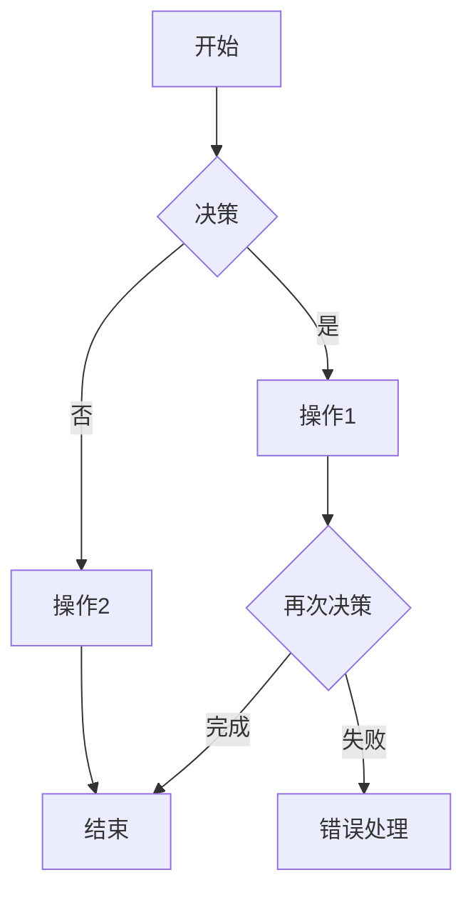

### 方向指令

| 方向 | 说明 | 适用场景 |
|------|------|---------|
| TD / TB | 从上到下 | 最常用 |
| BT | 从下到上 | 流程反向时 |
| LR | 从左到右 | 横向流程 |
| RL | 从右到左 | 横向反向 |

### 节点形状

| 形状 | 语法 | 用途 |
|------|------|------|
| 圆角矩形 | `[文字]` | 开始/结束 |
| 矩形 | `[文字]` | 普通步骤 |
| 菱形 | `{决策}` | 判断节点 |
| 圆柱形 | `[(数据库)]` | 数据存储 |
| 圆形 | `((圆形))` | 关键节点 |
| 六边形 | `{{六边形}}` | 准备/判断 |
| 并行四边形 | `[/平行四边形/]` | 输入/输出 |
| 子程序 | `[[子程序]]` | 子流程 |

### 连接线样式

| 样式 | 语法 | 用途 |
|------|------|------|
| 带箭头 | `-->` | 正常流向 |
| 虚线 | `-.-` | 弱关联/可选 |
| 加粗 | `==>` | 强调/主要路径 |
| 带标签 | `-->\|标签\|` | 标注条件 |
| 开放箭头 | `-->>` | 快速/异步 |

### 示例：用户登录流程

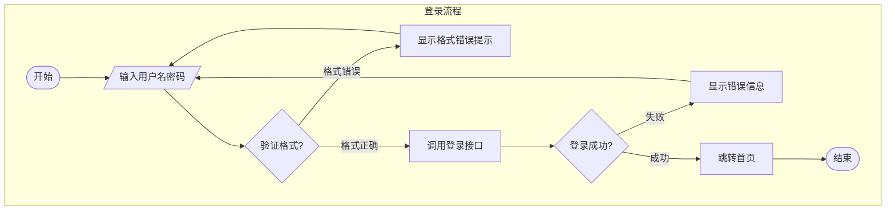

### 示例：订单处理流程

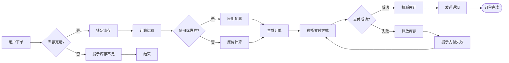

---

## 2. 时序图（sequenceDiagram）

### 基本语法

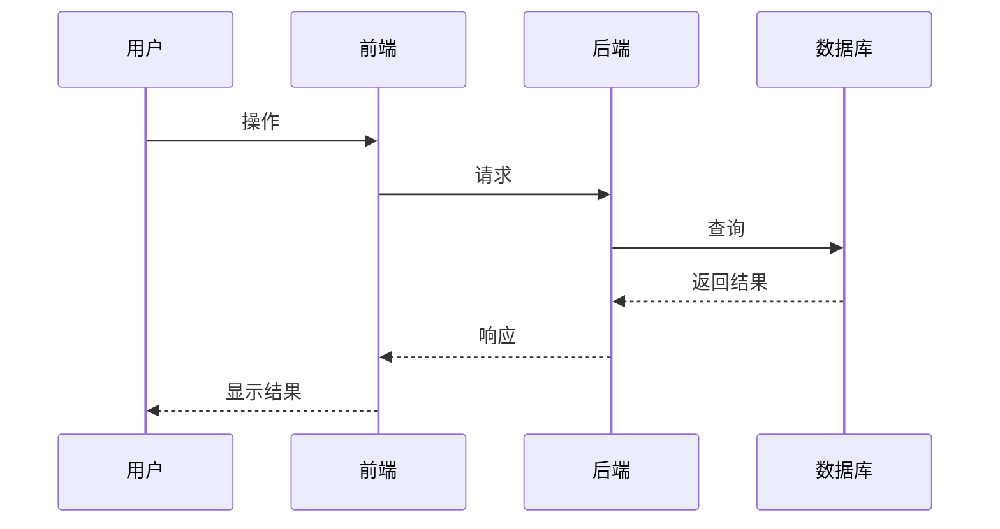

### 箭头类型

| 箭头 | 含义 |
|------|------|
| `->` | 同步请求 |
| `->>` | 同步请求（带箭头） |
| `-->` | 同步返回 |
| `-->>` | 异步返回 |
| `-)` | 异步消息（虚线箭头） |

### 示例：用户注册时序图

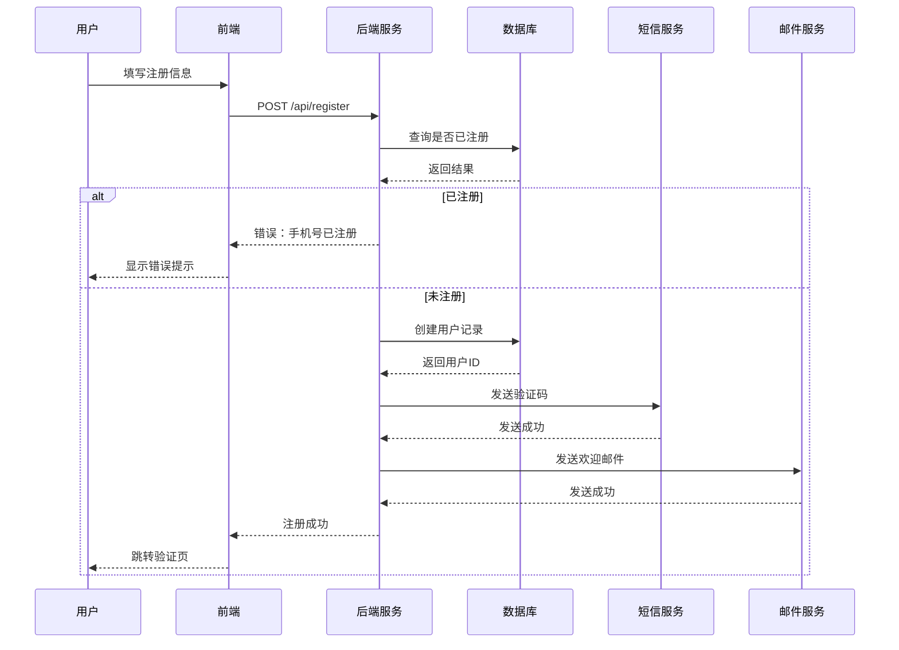

---

## 3. 状态图（stateDiagram-v2）

### 基本语法

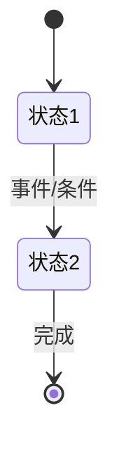

### 示例：订单状态流转

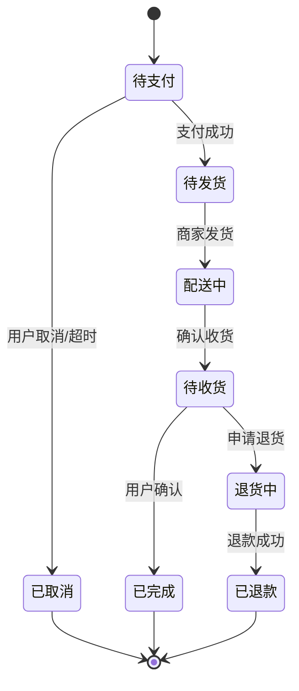

### 示例：工单状态机

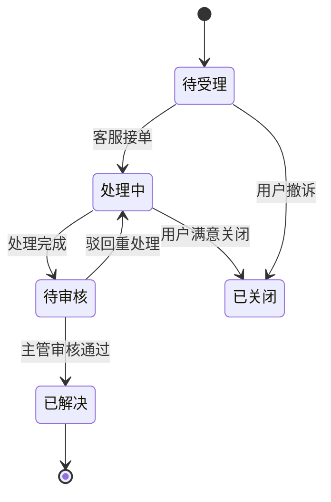

---

## 4. 甘特图（gantt）

### 基本语法

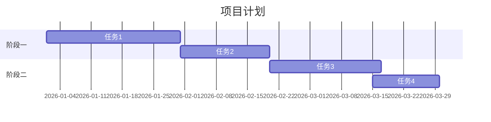

### 示例：产品迭代计划

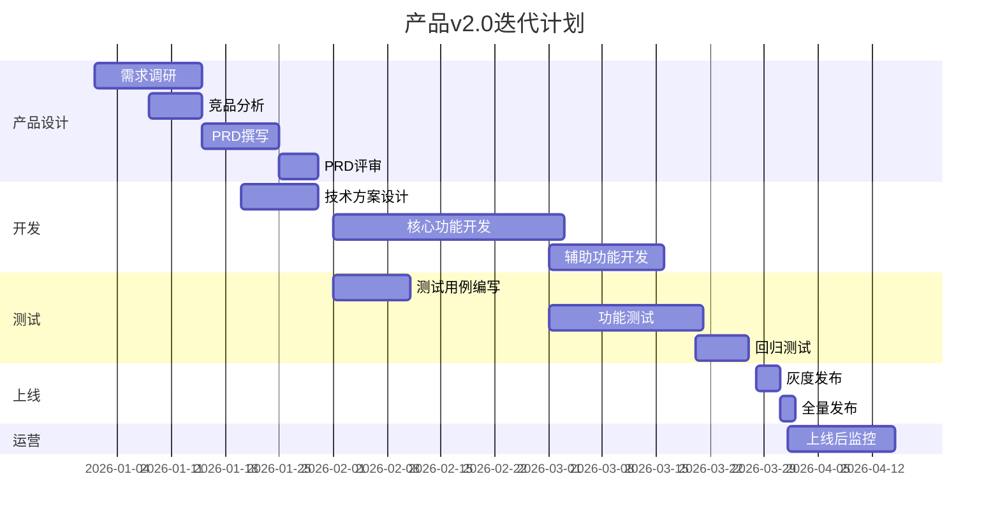

---

## 5. 用户旅程（journey）

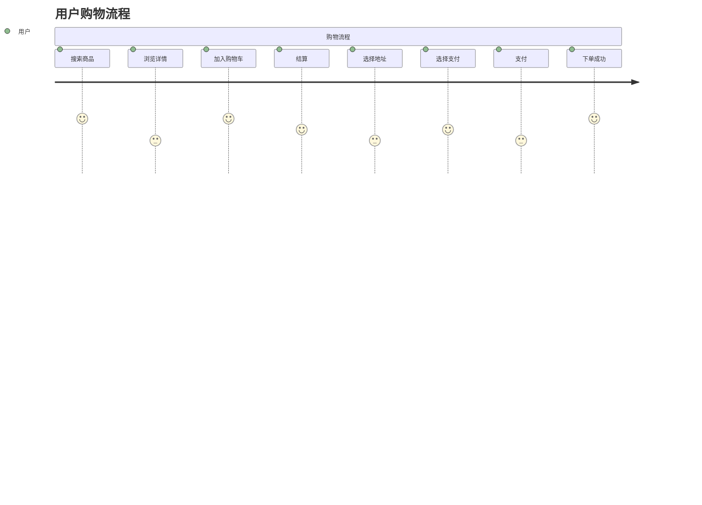

---

## 6. 饼图（pie）

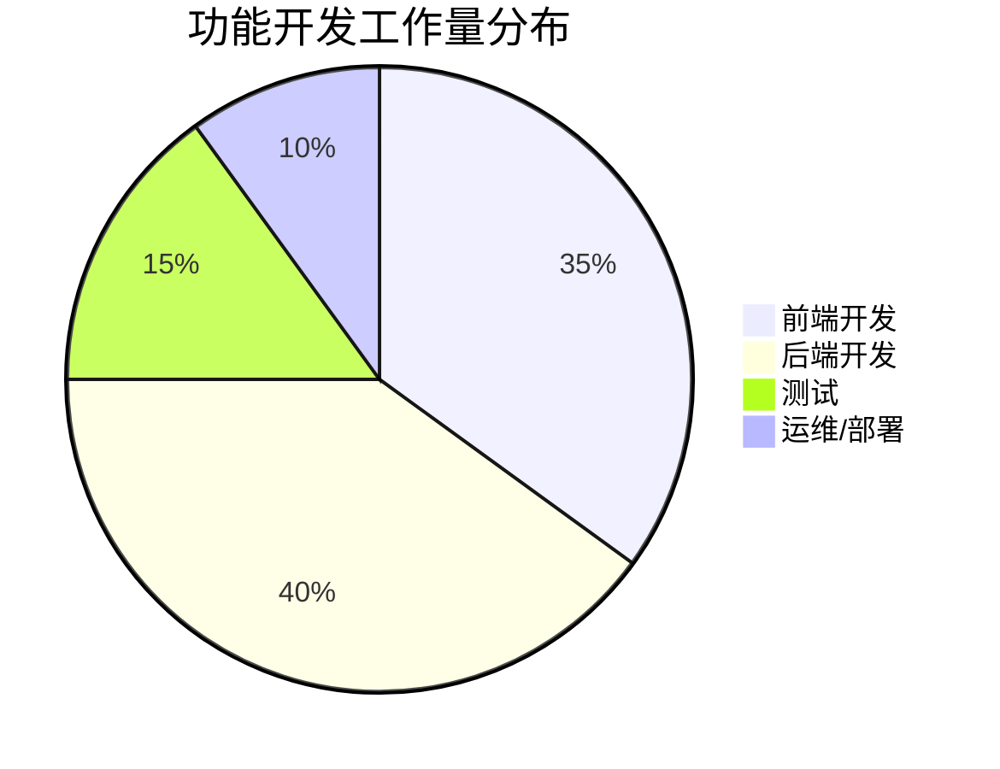

---

## 7. 架构图（C4Context）

### 安装与使用

C4 模型是一种软件架构可视化方法，用 4 个层级描述系统：
- **Context（上下文）** - 系统与外部交互者
- **Container（容器）** - 应用和技术组件
- **Component（组件）** - 容器的核心组件
- **Code（代码）** - 组件的具体实现

```mermaid
C4Context
    title 系统上下文

    Person(customer, "用户", "使用移动端和Web端")
    Person(admin, "管理员", "管理系统")
    System_Boundary(sb, "产品系统") {
        System(mobile, "移动App", "React Native")
        System(web, "Web管理后台", "Vue.js")
        System(api, "API网关", "Kong")
        System_Boundary(core, "核心服务") {
            System(order, "订单服务", "Java微服务")
            System(user, "用户服务", "Java微服务")
            System(pay, "支付服务", "Java微服务")
        }
        SystemDb(db, "数据库集群", "MySQL主从")
        System(cache, "缓存", "Redis集群")
        System(mq, "消息队列", "Kafka")
    }

    customer --> mobile: 使用
    customer --> web: 使用
    admin --> web: 管理
    mobile --> api: 调用
    web --> api: 调用
    api --> order: 调用
    api --> user: 调用
    api --> pay: 调用
    order --> db: 读写
    user --> db: 读写
    pay --> db: 读写
    order --> cache: 缓存
    order --> mq: 发布事件
```

---

## 8. 系统架构图（自定义风格）

### 微服务架构图

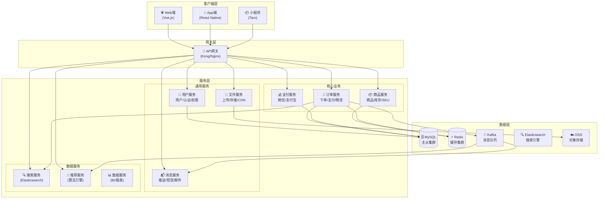

---

## 9. ER 图（数据库设计）

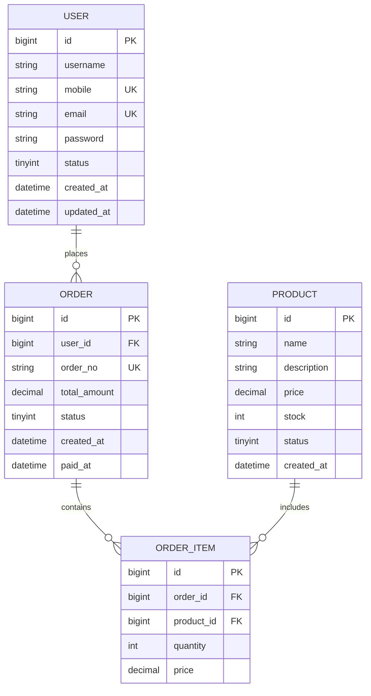

---

## 10. 用法建议

### 产品经理常用图表优先级

| 优先级 | 图表类型 | 使用场景 |
|--------|---------|---------|
| ⭐⭐⭐ | 流程图 | 用户流程、业务流程、系统交互 |
| ⭐⭐⭐ | 时序图 | API设计评审、技术方案沟通 |
| ⭐⭐⭐ | 甘特图 | 项目计划、里程碑展示 |
| ⭐⭐ | 状态图 | 订单状态、工单流转、生命周期 |
| ⭐⭐ | 架构图 | 系统设计、技术选型汇报 |
| ⭐ | ER图 | 数据库设计、技术评审 |

### 绘制原则

1. **简洁清晰** - 一张图说清一件事，不要试图把所有东西画在一起
2. **命名规范** - 节点命名用「谁+做什么」格式，如"用户点击登录"
3. **标注关键** - 关键判断条件、数据走向要标注清楚
4. **颜色统一** - 同类元素用同一颜色
5. **导出格式** - PRD 中使用 SVG 格式，代码评审用 Mermaid 原生

### 在不同工具中使用 Mermaid

| 工具 | 使用方式 |
|------|--------|
| Typora | 直接粘贴 Mermaid 代码块 |
| Notion | 使用 ` ```mermaid ` 代码块 |
| 飞书文档 | 使用 ` ```mermaid ` 代码块 |
| GitHub/GitLab | README.md 直接支持 |
| Draw.io | 插入 → 高级 → Mermaid |
| ProcessOn | 导入 Mermaid |
| PowerPoint | 截图或导出 SVG |

---

## 来源

> 来源：Mermaid 官方文档（2026）
> https://mermaid.js.org/
> https://mermaid.js.org/syntax/flowchart.html
> https://mermaid.js.org/syntax/sequenceDiagram.html
> https://mermaid.js.org/syntax/stateDiagram.html
> https://mermaid.js.org/syntax/gantt.html
