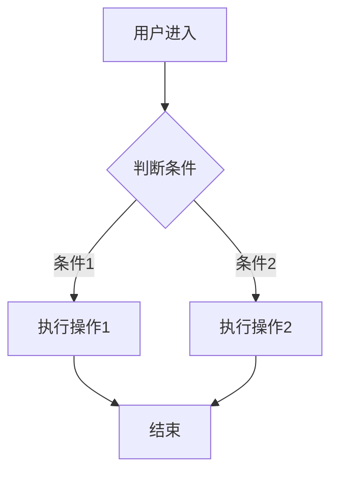

# PRD 产品需求文档规范

> 来源：PRD 文档规范综合（2026）
> https://www.woshipm.com/  https://www.zhouqicf.com/  https://www.productboard.com/
> https://www.atlassian.com/software-development-lifecycle

## 模板正文

---

# [产品名称] - 产品需求文档（PRD）

| 版本 | 日期 | 作者 | 变更说明 |
|------|------|------|---------|
| v1.0 | 2026-XX-XX | [姓名] | 初始版本 |

---

## 一、文档信息

| 字段 | 内容 |
|------|------|
| 产品名称 | [填写] |
| 文档版本 | v1.0 |
| 状态 | 草稿/评审中/已确认 |
| 所属项目 | [项目名] |
| 所属产品线 | [产品线] |

---

## 二、背景与目的

### 2.1 项目背景

> 描述：为什么做这个产品/功能？市场环境、用户痛点、现有问题是什么？

**市场背景：**
[描述市场规模、趋势、政策环境]

**用户痛点：**
| 痛点 | 当前解决方案 | 不足 |
|------|------------|------|
| [痛点1] | [当前方案] | [不足] |
| [痛点2] | [当前方案] | [不足] |

**机会窗口：**
[为什么现在做？时间紧迫性或市场机会]

### 2.2 产品目标

| 目标类型 | 目标描述 | 衡量指标 | 目标值 |
|---------|---------|---------|--------|
| 业务目标 | [描述] | [指标] | [目标值] |
| 用户目标 | [描述] | [指标] | [目标值] |
| 技术目标 | [描述] | [指标] | [目标值] |

**北极星指标：**
[产品最核心的单一指标]

**OKR 关联：**
- O1：[目标]
  - KR1：[关键结果]
  - KR2：[关键结果]

### 2.3 成功标准

| 维度 | 指标 | 上线目标 | 稳定期目标 |
|------|------|---------|-----------|
| 活跃度 | DAU/MAU | [值] | [值] |
| 转化率 | 注册转化/功能使用率 | [值] | [值] |
| 留存 | 次日/7日/30日留存 | [值] | [值] |
| 满意度 | NPS/评分 | [值] | [值] |
| 性能 | 响应时间/P99 | [值] | [值] |

---

## 三、用户与场景

### 3.1 目标用户画像

**用户群体A - [名称]：**
- 基本属性：年龄、职业、使用场景
- 核心需求：[最想解决的问题]
- 使用频率：高频/中频/低频
- 技术能力：新手/普通/专家
- 痛点优先级：P0/P1/P2

**用户群体B - [名称]：**
（同上格式）

### 3.2 用户旅程地图（User Journey）

```
阶段      认知      考虑      决策      使用      留存      推荐
          ↓         ↓         ↓         ↓         ↓         ↓
用户行为  [看到广告] [对比产品] [注册试用] [日常使用] [持续使用] [推荐朋友]
触点      [小红书]  [官网]    [试用7天]  [App]     [App]     [微信]
情感曲线  ○→○→○○→○○○→○○→○
痛点      [不了解]  [太复杂]  [门槛高]  [不稳定]  [功能少]  [没动力]
机会      [快速上手] [易理解]  [零门槛]  [稳定流畅] [丰富功能] [奖励机制]
```

### 3.3 用户场景与用例

**场景1：[场景名称]**

| 字段 | 内容 |
|------|------|
| 用户 | [用户画像] |
| 前置条件 | [登录状态、网络条件等] |
| 触发 | [用户如何开始] |
| 主要流程 | 1. [步骤1]<br>2. [步骤2]<br>3. [步骤3] |
| 异常流程 | E1: [异常1及处理]<br>E2: [异常2及处理] |
| 后置条件 | [完成后状态] |
| 验收标准 | [可测试的验收条件] |

---

## 四、功能需求

### 4.1 功能总览

| 功能模块 | 功能名称 | 优先级 | 负责人 | 状态 |
|---------|---------|--------|--------|------|
| M1 用户 | F1 注册登录 | P0 | [PM] | 规划中 |
| M1 用户 | F2 个人信息 | P1 | [PM] | 规划中 |
| M2 核心业务 | F3 XX功能 | P0 | [PM] | 规划中 |

**优先级说明：**
- P0：必须在上线版本中
- P1：上线后尽快迭代
- P2：后续版本规划

### 4.2 功能详细说明

#### F1 [功能名称]

**功能描述：**
[一段话描述这个功能做什么]

**用户故事：**
```
作为 [用户类型]
我想要 [做某事]
以便 [达到某目标]
```

**业务流程图：**


**功能详细说明：**

| 页面/状态 | 说明 |
|---------|------|
| 初始状态 | [页面加载时的状态] |
| 操作后 | [用户操作后的变化] |
| 空状态 | [无数据时显示] |
| 加载状态 | [数据加载中] |
| 错误状态 | [异常情况] |
| 成功状态 | [操作成功后] |

**字段说明：**

| 字段名 | 类型 | 必填 | 长度 | 说明 | 校验规则 |
|--------|------|------|------|------|---------|
| field_a | String | 是 | ≤32 | [说明] | 非空 |
| field_b | Number | 否 | - | [说明] | ≥0 |

**接口说明：**

| 接口 | 方法 | 路径 | 说明 |
|------|------|------|------|
| 获取列表 | GET | /api/list | 分页获取 |
| 创建 | POST | /api/create | 创建记录 |

**验收标准：**
- [ ] [可测试的验收条件1]
- [ ] [可测试的验收条件2]
- [ ] 异常情况有合理提示

**边界情况：**
| 情况 | 预期行为 |
|------|---------|
| 网络断开 | 显示断网提示，允许重试 |
| 数据为空 | 显示空状态页 |
| 数据加载慢（>3s） | 显示骨架屏 |

---

## 五、非功能需求

### 5.1 性能需求

| 指标 | 要求 |
|------|------|
| 页面加载时间 | 首屏 < 2s（4G） |
| 接口响应时间 | P99 < 500ms |
| 并发用户 | 支持 10000 DAU |
| 数据规模 | 单用户数据 ≤ 10000 条 |

### 5.2 安全需求

| 需求 | 说明 |
|------|------|
| 身份认证 | Token 机制，JWT 有效期内有效 |
| 权限控制 | RBAC，菜单/按钮级权限 |
| 数据安全 | 敏感数据加密传输（HTTPS） |
| 隐私合规 | 遵循 GDPR/个人信息保护法 |

### 5.3 可用性需求

| 需求 | 说明 |
|------|------|
| 可用性 | 99.9%（计划内维护除外） |
| 故障恢复 | MTTR < 30min |
| 降级策略 | 核心功能优先保障，非核心可降级 |

### 5.4 兼容性需求

| 平台 | 最低版本 |
|------|---------|
| iOS | 14.0 |
| Android | 8.0 (API 26) |
| Web | Chrome 90+ / Safari 14+ / Firefox 88+ |

---

## 六、风险与依赖

### 6.1 风险评估

| 风险 | 概率 | 影响 | 评级 | 应对策略 |
|------|------|------|------|---------|
| [风险1] | 高/中/低 | 高/中/低 | P0 | [策略] |
| [风险2] | 高/中/低 | 高/中/低 | P1 | [策略] |

### 6.2 依赖项

| 依赖项 | 负责方 | 计划完成 | 状态 |
|--------|--------|---------|------|
| [依赖1] | [团队] | [日期] | 待确认 |
| [依赖2] | [团队] | [日期] | 待确认 |

---

## 七、附录

### 7.1 术语表

| 术语 | 定义 |
|------|------|
| [术语] | [定义] |

### 7.2 修订记录

| 版本 | 日期 | 作者 | 变更说明 |
|------|------|------|---------|
| v0.1 | 2026-XX-XX | [姓名] | 初稿 |
| v0.2 | 2026-XX-XX | [姓名] | 补充XX内容 |
| v1.0 | 2026-XX-XX | [姓名] | 评审通过，冻结 |

### 7.3 参考资料

- [文档1链接]
- [文档2链接]
- [竞品截图]

---

## 使用说明

本模板为 **通用 PRD 模板**，使用时：
1. 根据产品类型裁剪章节（不需要的可删除或标注"不适用"）
2. 根据项目规模调整详细程度（小功能可简化，大产品需完整）
3. 保持格式一致，便于团队阅读
4. 评审后冻结版本，后续变更走需求变更流程

---

## PRD 版本管理策略

### 版本号规范

**语义化版本（Semantic Versioning）：**

| 版本格式 | 说明 | 适用场景 |
|---------|------|---------|
| v1.0.0 | 主版本.次版本.修订号 | 重大更新 |
| v1.0 | 主版本.次版本 | 一般迭代 |
| v1.0-draft | 草稿版本 | 评审中 |

**版本阶段定义：**

| 阶段 | 后缀 | 说明 | 可见范围 |
|------|------|------|---------|
| 草稿 | -draft | 正在编写 | PM内部 |
| 评审中 | -review | 评审中 | 评审委员会 |
| 已确认 | 无 | 评审通过 | 全体团队 |
| 已冻结 | -frozen | 冻结不接受变更 | 全体团队 |
| 已废弃 | -deprecated | 不再使用 | 历史存档 |

**版本变更规则：**
- **主版本（v2.0）**：产品方向重大调整、架构重构、用户基本操作流程变更
- **次版本（v1.2）**：新增重要功能、功能重大优化
- **修订号（v1.2.3）**：小功能增加、Bug修复、文档补充

### 版本变更记录规范

**变更记录必填字段：**

| 字段 | 说明 | 示例 |
|------|------|------|
| 变更版本 | 变更涉及的版本 | v1.2 |
| 变更日期 | 变更提交的日期 | 2026-04-15 |
| 变更类型 | 变更分类 | 新增/修改/删除/优化 |
| 变更内容 | 具体变更描述 | 增加XX功能 |
| 变更原因 | 为什么变 | 用户反馈XX问题 |
| 变更人 | 谁做的变更 | 张三 |
| 审批人 | 谁审批的 | 李四 |

**变更类型说明：**

| 类型 | 说明 | 处理方式 |
|------|------|---------|
| 新增（Add） | 新增功能点 | 新增需求项 |
| 修改（Modify） | 已有功能变更 | 标注变更前后对比 |
| 删除（Remove） | 移除功能 | 说明移除原因和影响 |
| 优化（Optimize） | 体验/性能优化 | 说明优化目标 |

---

## PRD 评审会议议程模板

### 评审前准备

**PM 需准备：**
- [ ] PRD 文档提前 2 天发送给评审委员
- [ ] 准备评审 PPT（10-15页，核心内容）
- [ ] 准备 Demo 环境或原型演示
- [ ] 确认评审委员已阅读文档
- [ ] 预定会议室，准备投影/投屏设备

**评审委员职责：**
| 角色 | 关注点 |
|------|--------|
| 开发负责人 | 技术可行性、工作量评估 |
| 设计负责人 | 用户体验、设计一致性 |
| QA 负责人 | 测试可行性、测试范围 |
| 业务代表 | 业务逻辑、功能完整性 |
| 项目经理 | 进度、资源、风险 |

### 评审会议议程（90分钟）

| 时间 | 环节 | 内容 | 负责人 |
|------|------|------|--------|
| 0-5min | 开场 | 介绍评审目的、产品背景 | PM |
| 5-20min | 背景介绍 | 市场背景、用户痛点、产品目标 | PM |
| 20-50min | 功能演示 | 核心功能演示、交互流程演示 | PM |
| 50-70min | 讨论环节 | 质疑讨论、可行性评估 | 全体 |
| 70-85min | 风险评估 | 技术风险、业务风险、资源风险 | 全体 |
| 85-90min | 总结决策 | 评审结论、下一步行动 | PM |

### 评审结论模板

**评审结论分类：**

| 结论 | 条件 | 后续动作 |
|------|------|---------|
| 通过 | 无重大问题，或小问题当场解决 | 进入开发阶段 |
| 有条件通过 | 有问题但不影响进入开发 | 收到反馈后修改，3天内确认 |
| 需重审 | 问题较多或重大 | 修改后重新评审 |
| 拒绝 | 方向性问题或价值不足 | 重新论证或取消 |

**评审决策表：**

| 问题 | 严重程度 | 处理方式 | 负责人 | 截止日期 |
|------|---------|---------|-------|---------|
| [问题1] | P0/P1/P2 | [处理方式] | [人] | [日期] |
| [问题2] | P0/P1/P2 | [处理方式] | [人] | [日期] |

---

## 常见 PRD 陷阱与规避

### 内容层面陷阱

**陷阱1：把解决方案当问题描述**
- ❌ 错误："用户需要一个搜索框来查找商品"
- ✅ 正确："用户在500+商品的目录中找不到目标商品，当前通过分类浏览效率低（平均需要点击7次）"

**陷阱2：忽略异常流程和边界情况**
- ❌ 错误：只描述正常流程
- ✅ 正确：网络异常、加载超时、数据为空、权限不足、并发操作等都要覆盖

**陷阱3：验收标准模糊**
- ❌ 错误："界面美观、易用"
- ✅ 正确："页面加载时间<2s，操作步骤≤3步，NPS评分≥40"

**陷阱4：需求颗粒度不一致**
- 部分需求写得很细，部分很粗
- 同级别需求应该颗粒度相近

**陷阱5：缺少优先级和范围定义**
- 迭代范围不明确
- 什么必须做、什么可选做、什么不做没有说清楚

### 协作层面陷阱

**陷阱6：评审流于形式**
- 评审委员不提前看文档
- 评审时才发现重大问题
- 规避：提前分发文档，设置评审门槛

**陷阱7：变更控制缺失**
- 开发过程中随意变更
- 口头变更无记录
- 规避：建立变更申请流程，记录变更影响

**陷阱8：过度追求文档完美**
- PM 花大量时间写完美文档，影响迭代速度
- 规避：MVP思维，文档够用就好

**陷阱9：忽略技术约束**
- 文档中的设计在技术上难以实现或成本极高
- 规避：技术方案早期参与评审

**陷阱10：跨部门信息不对称**
- 开发、测试、运营对需求理解不一致
- 规避：评审时确保关键角色参与，会后同步纪要

---

## 不同产品类型的 PRD 侧重点

### B2B 产品 vs B2C 产品

**B2B 产品 PRD 侧重点：**

| 维度 | B2B 特点 | PRD 重点 |
|------|---------|---------|
| 用户 | 角色多（决策者/使用者/采购者分离） | 区分用户角色，权限体系 |
| 需求 | 流程复杂，定制化需求多 | 流程图、角色权限矩阵 |
| 文档 | 要求正式、详细 | 合同级需求规格 |
| 集成 | 多系统集成 | 接口规格、数据格式 |
| 合规 | 审计、安全要求高 | 安全需求、权限日志 |
| 验收 | 验收周期长 | 验收标准明确，分阶段验收 |

**B2C 产品 PRD 侧重点：**

| 维度 | B2C 特点 | PRD 重点 |
|------|---------|---------|
| 用户 | 量大、角色单一 | 用户画像、使用场景 |
| 需求 | 体验要求高 | 交互细节、异常处理 |
| 文档 | 快速迭代 | 简洁、重点突出 |
| 性能 | 高并发 | 性能需求、压测指标 |
| 增长 | 关注转化漏斗 | 转化路径、增长指标 |
| 个性化 | 千人千面 | 个性化策略、数据埋点 |

### 移动端 vs Web 端产品

**移动端 PRD 侧重点：**

| 维度 | 移动端特点 | PRD 重点 |
|------|-----------|---------|
| 设备适配 | 多机型、多系统版本 | 适配要求、测试范围 |
| 权限 | 位置、相机、通知等 | 权限使用说明、申请时机 |
| 离线 | 可能无网络 | 离线功能、离线数据同步 |
| 推送 | 消息推送 | 推送策略、频率控制 |
| 版本更新 | App Store审核 | 版本兼容性、回退方案 |
| 手势 | 滑动、缩放等 | 手势交互说明 |
| 性能 | 电量、网络 | 性能优化建议 |

**Web 端 PRD 侧重点：**

| 维度 | Web端特点 | PRD 重点 |
|------|---------|---------|
| 浏览器兼容 | 多浏览器 | 兼容版本、Polyfill策略 |
| 响应式 | 多屏幕尺寸 | 响应式断点、设计规范 |
| SEO | 搜索引擎优化 | 页面结构、元信息 |
| 刷新 | 页面刷新 | 状态保持、缓存策略 |
| 无障碍 | 残障人士 | 无障碍标准符合 |
| 安全 | XSS/CSRF等 | 安全防护说明 |
